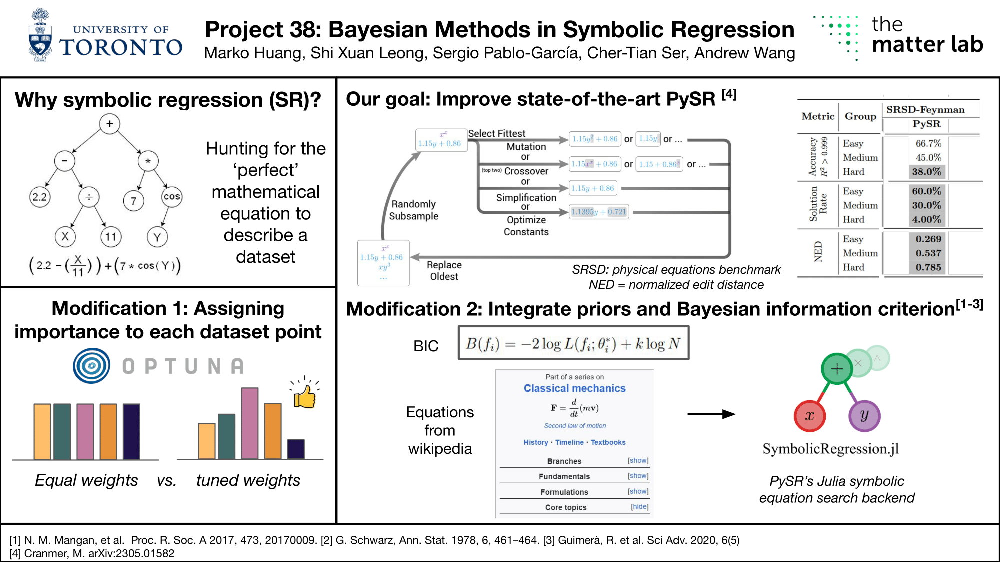

# Project 38: Bayesian Methods in Symbolic Regression
by [Marko Huang](https://github.com/markohuang), [Shi Xuan Leong](https://github.com/shixuanleong), [Sergio Pablo-García](https://github.com/spgarcica), [Cher-Tian Ser](https://github.com/chertianser), [Andrew Wang](https://github.com/wavyparticle)

The Matter Lab, University of Toronto

## Poster

## Video Presentation

## Project Description
This project investigates the use of Bayesian methods in symbolic regression for use in the physical sciences. Symbolic regression (SR) is a machine learning approach that aims to obtain an analytical mathematical expression to fit a dataset, through optimizing the mathematical operations and coefficients within the expression. The interpretability of these expressions make it attractive for deployment across multiple use cases, including the derivation of physical laws. State-of-the-art SR methods like PySR [1] involve the use of genetic programming (or genetic algorithms) to construct such functions, which are unable to incorporate expert knowledge and are thus inefficient in its sampling of mathematical expressions. While a Bayesian version of symbolic regression was proposed and implemented to replace the genetic component of expression construction [2], its performance on the general symbolic regression benchmark SRBench was poor [3].

Our goal is to evaluate how PySR can be enhanced using other Bayesian methods to achieve better performance in the discovery of analytical expressions for the physical sciences. First, we consider the effect of tuning datapoint importance in a Bayesian manner with Optuna [4] to achieve high accuracy on generated symbolic expressions. Next, we implement the Bayesian Information Criterion in the mutation functions of PySR to bias the population towards the formation of reasonable mathematical expressions based on a prior constructed on known equations [5]. We achieve this by performing these benchmarks on a physical-science focused symbolic regression benchmark SRSD [6]. 

## References

[1] M. Cranmer, “Interpretable Machine Learning for Science with PySR and SymbolicRegression.jl.” arXiv, May 05, 2023. doi: 10.48550/arXiv.2305.01582.

[2] Y. Jin, W. Fu, J. Kang, J. Guo, and J. Guo, “Bayesian Symbolic Regression.” arXiv, Jan. 15, 2020. doi: 10.48550/arXiv.1910.08892.

[3] W. La Cava et al., “Contemporary Symbolic Regression Methods and their Relative Performance.” arXiv, Jul. 29, 2021. doi: 10.48550/arXiv.2107.14351.

[4] T. Akiba, S. Sano, T. Yanase, T. Ohta, and M. Koyama, “Optuna: A Next-generation Hyperparameter Optimization Framework.” arXiv, Jul. 25, 2019. doi: 10.48550/arXiv.1907.10902.

[5] R. Guimerà et al., “A Bayesian machine scientist to aid in the solution of challenging scientific problems,” Science advances, vol. 6, no. 5, p. eaav6971, 2020.

[6] Y. Matsubara, N. Chiba, R. Igarashi, and Y. Ushiku, “Rethinking Symbolic Regression Datasets and Benchmarks for Scientific Discovery.” arXiv, Mar. 05, 2024. doi: 10.48550/arXiv.2206.10540.

